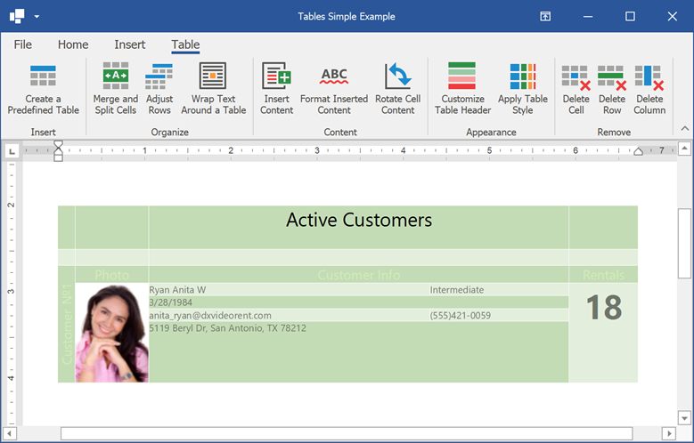

<!-- default badges list -->

<!-- default badges end -->
# WinForms Rich Text Editor - Create a Table in Code

The following example demonstrates how to use [RichEditControl](https://docs.devexpress.com/WindowsForms/DevExpress.XtraRichEdit.RichEditControl) to manage document tables in code.

# Files to Review

* [Form1.cs](./CS/TablesSimpleExample/Form1.cs) (VB: [Form1.vb](./VB/TablesSimpleExample/Form1.vb))

# Documentation

* [Tables in Rich Text Documents](https://docs.devexpress.com/WindowsForms/8306/controls-and-libraries/rich-text-editor/rich-edit-control-document/tables)
<!-- feedback -->
## Does this example address your development requirements/objectives?

 

(you will be redirected to DevExpress.com to submit your response)
<!-- feedback end -->
